# Discription

包含：	增加索引、更新索引
		call_id查询、dialog_id查询、session_id查询、topic查询、静默时间查询、
		时间范围查询、interruption查询、文本单句搜索、文本多句搜索、
		文本复杂逻辑精准搜索、话术分析器查询、文本分析器查询

# Requirements
- python3
- elasticsearch

# Enviroments
### 1.操作系统：linux14.04
### 2.java环境

查看java -version

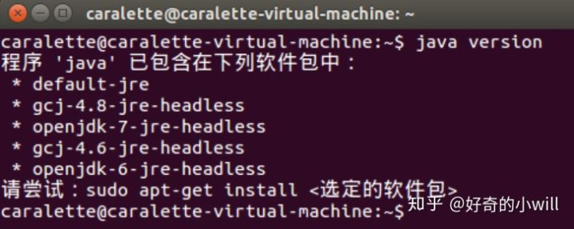

若没有Java环境，需进行配置，命令如下：

```
	sudo add-apt-repository ppa:webupd8team/java
	sudo apt-get update
	sudo apt-get install oracle-java8-installer
	sudo apt-get install oracle-java8-set-default
```

配置成功后查看java -version，应显示配置完成

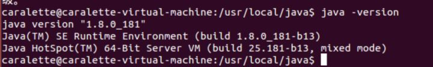


### 3.Elasticsearch 环境部署安装
在Elasticsearch官网下载对应的版本,即6.4.1版本

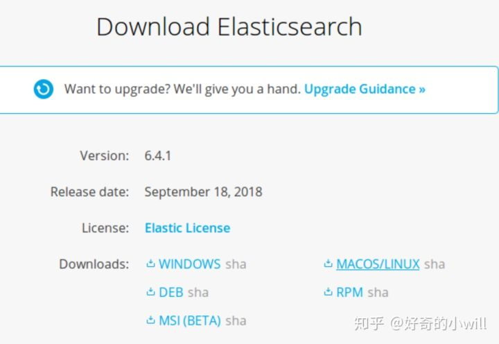

下载后解压文件：
```
	sudo tar -zxvf elasticsearch-6.4.1.tar.gz
```

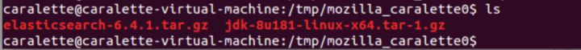
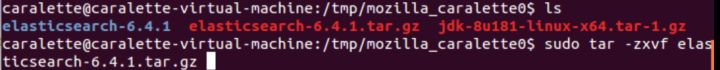
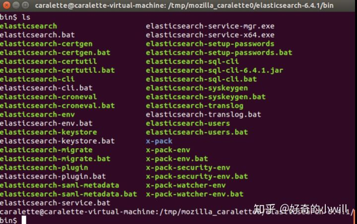	

解压以后切换到elasticsearch对应的文件目录下 ./bin/elasticsearch启动搜索引擎

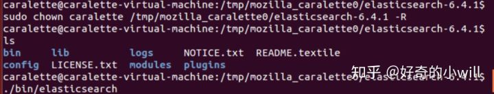

查看节点状态:
	```
	curl localhost:9200/_cat/health?v
	```
如所示，ES节点已经成功启动	

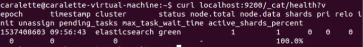

若ES启动权限不够，需手动提升权限：	
```
	（示例）sudo chown caralette /tmp/mozilla_caralette0/elasticsearch-6.4.1() -R
```
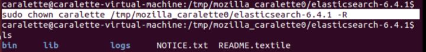
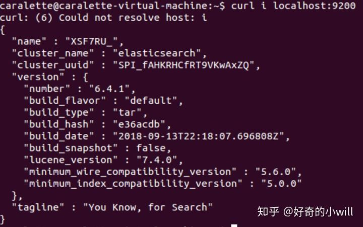

在解压目录下 config 文件夹中找到 elasticsearch.yml文件，将networkhost 修改为0.0.0.0
此处需注意：1.在networkhost的冒号后应有一个空格
			2.将前面的＃去掉
			
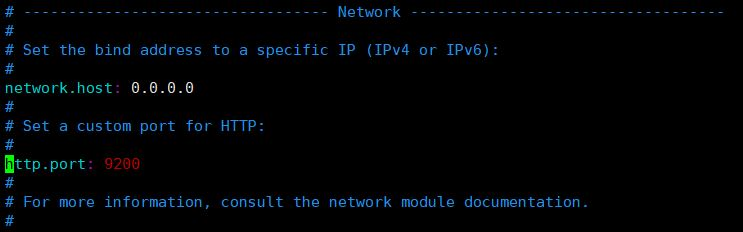

重新启动ES，应当能成功启动，并看见：
```
	'bound_addresses{[::1]:9200},{yourIP:9200}'	
```

输入地址，以检测外网访问是否设置成功
```
	curl http://yourIP:9200/
```
返回信息如下则配置成功

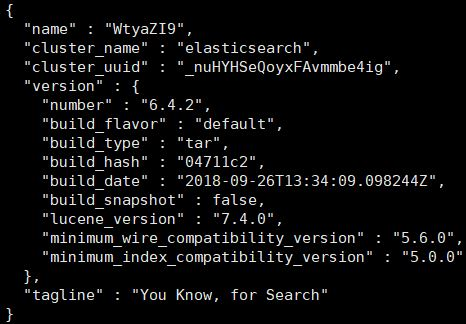


